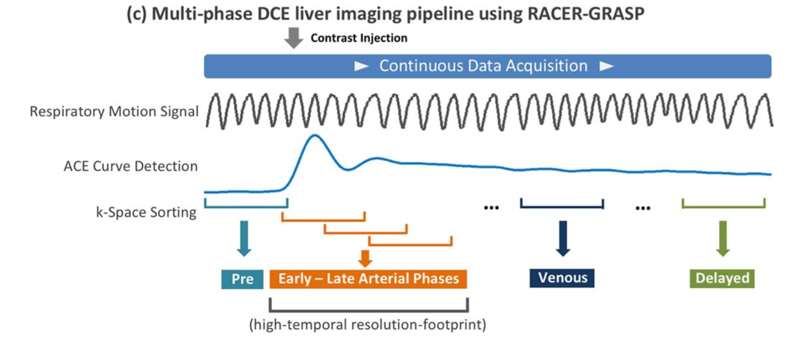
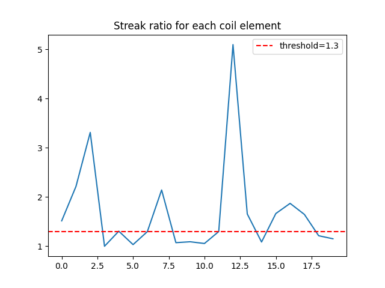
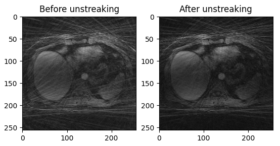
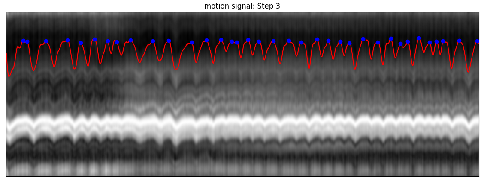

# RACER-GRASP

## Method

The RACER-GRASP technique [1] is an extension of GRASP to include:

- coil unstreaking (for removal of coilrelated streaking artifacts),
- ACE-guided k-space sorting (with a role similar to conventional bolus timing),
- respiratory-weighted image reconstruction (for reduction of motion-induced blurring).

It aims to deliver a new freebreathing DCE-MRI pipeline as shown in the figure below, which enables motion-suppressed and streaking-artifact reduced reconstruction to capture clinically relevant contrast phases and information

## Detailed implementation

### 1. Coil Untreaking

Weight multicoil kspace according to streaking artifact level calculated for each individual coil during image reconstruction, so that coil elements containing a high level of streaking artifacts contribute less to the final results.

plot the streak ratio for each coil element

Note that the images displayed below are before iterative reconstruction. Thus, they both have strearking artifacts. However, note that the right image has significantly less streaks

### 2. Respiratory Motion detection

z-projection profiles of the entire imaging volume are computed by performing a 1-dimensional partition-direction fast Fourier transform on the series of central k-space points. The signal intensity of each projection is normalized between 0 and 1 so that the effect of contrast enhancement can be partially compensated. Then the following three steps are performed to generate respiratory signal:

- Step 1: find the coil elements with good representation of respiratory motion from the late enhancement spokes
- Step 2: estimate motion signal using PCA from the selected coil elements
- Step 3: estimate the envelop of the signal and substract it from the signal

### 3. Bolus signal detection

TODO

### 4. Respiratory-weighted Iterative Reconstruction

$$
x = \underset{x}{\arg\min} ||\frac{W}{R}(F\cdot C \cdot x-y_c)||^2_2+\lambda_1||S \cdot x||_1
$$

$x$ is the reconstructed image, $F$ is the NUFFT operator, $C$ is the coil sensitivity map, $y_c$ is the measured k-space data on each coil, $S$ is the sparsity operator (total variation), and $\lambda_1$ is the regularization parameter.$W$ represents motion weights for different respiratory phases, $R$ represents the streak-ratio weights to adjust the contribution of each coil in the data consistency term.

## Reconstruction results

info: 11 slices, 96 spokes/slice, unstreaking & respiratory soft-weighted reconstruction

[TODO: upload video ]

## Reference

[1] Feng, Li, et al. "RACER‐GRASP: respiratory‐weighted, aortic contrast enhancement‐guided and coil‐unstreaking golden‐angle radial sparse MRI." *Magnetic resonance in medicine* 80.1 (2018): 77-89.
